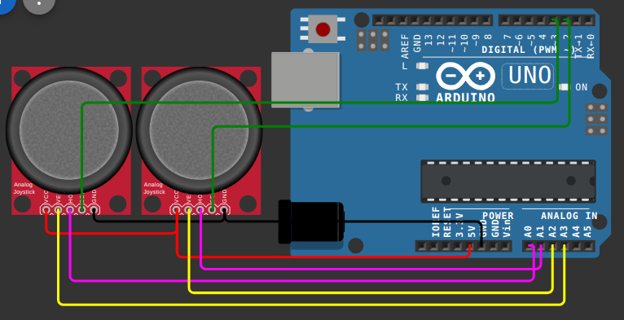

COMPONENTS REQUIRED:
<ol>
  <li>Arduino Uno/Nano/Mega/Mini</li>
  <li>Joystick module x2</li>
  <li>Jumper Wires</li>
  <li>Breadborad (optional)</li>
</ol>

Upload the Arduino code to your Arduino Uno/Nano/Mini
For the python script, download python IDLE, paste the code and run it. Minimize the window and it should work
For wiring, follow the Wiring.png and Wiring(new).png


Important Note: Also in the python code replace 'COM8' with our suitable serial port (like for instance COM3 ror /dev/ttyUSB0 on linux)
To check for serial prot, connect your arduino, open system manager and look for other devices

Important Note: If you want to play games like minecraft with this, then go to settings, mouse controls and there should be an option called "raw controls" or something, make sure to disable that.

Note: Also run pip install pyserial and ```pip install pynput``` in cmd or terminal
